# Usage - Interaction Between a Drupal Frontend and CiviCRM Backend

## Use Case: Single Case Type

### In CiviCRM: Add a Case Type with a Set of Custom Fields

Add a new *case type* and add *case statuses* for that type.
Note: *case statuses* will be used by the `reimbursement` extension, [as shown later](#in-civicrm-configure-the-reimbursement-extension).

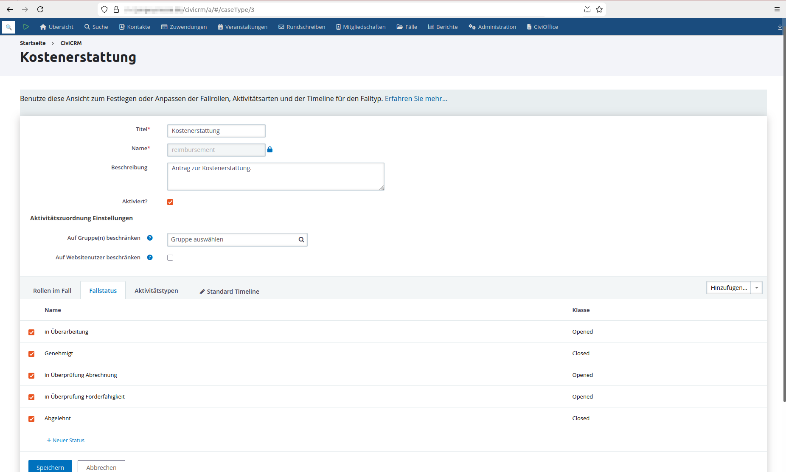

Add a new *custom group* for the new *case type*:

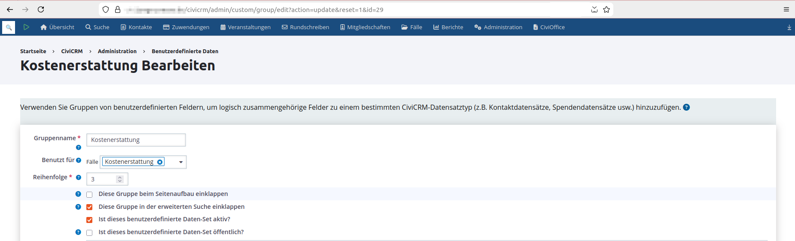

Add *custom fields* to that group.
Note: all fields defined here will show up in the rendered frontend form.

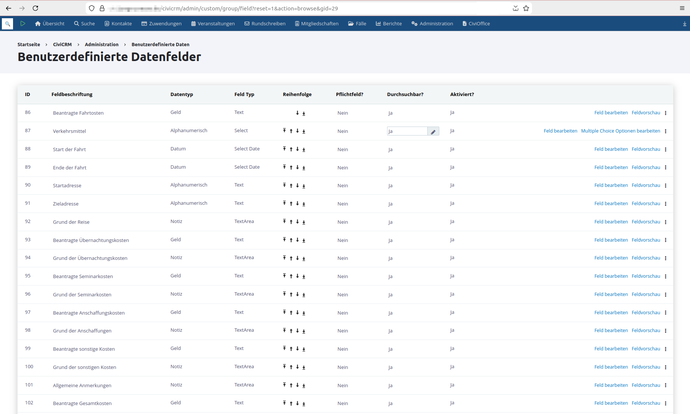

### In CiviCRM: Add Expense Types

Note: the created *expense types* will be configured to be used by the `reimbursement` extension in order to show up in the rendered frontend form, [as shown later](#in-drupal-load-the-create-form).

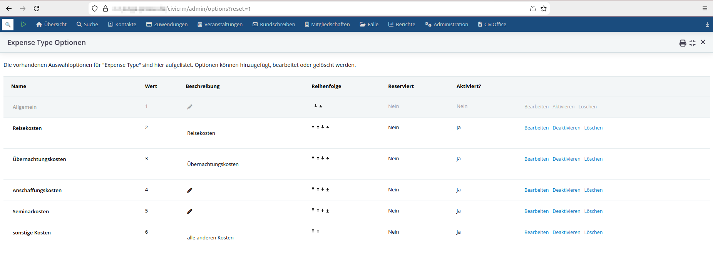

### In CiviCRM: Configure the Reimbursement Extension

Create a new profile for the new *case type*.

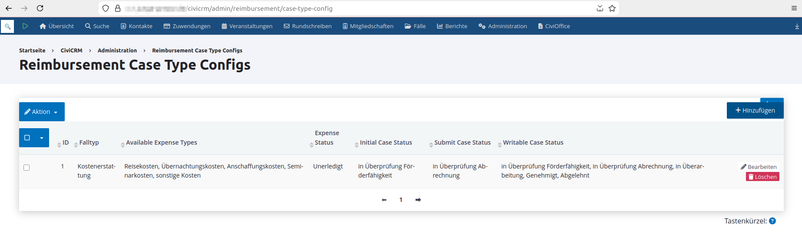

Configure the new profile.
Here want to see the following behavior of the rendered frontend form:

- set the initial *case status* for a new case upon case-creation
- set the submission *case status* for a new or existing case upon submission
    - specifying a *case type* here will enable the `Submit` button in the frontend form
- choose the *expense types* to be shown in the frontend form
    - here we want to have five different *expense types* for which costs can be registered in the case
    - for each selected *expense type*, a particular section will be rendered in the frontend-form
- set the status of a new expense to a particular *status type*
- choose where to display the expenses in the frontend form
    - here we want to place the expense section above the case fields section
- assigning a label to the `Save` button
    - the `Save` button does not cause a change of *case status* upon form submission, except when the case is being created, as selected as initial *case status*
- set the label of the `Submit` button
    - the `Submit` button will cause a change of *case status* upon form-submission, as selected as submission *case status*
- choose labels for the buttons of individual expenses in the frontend form (add/remove expense, add/remove attachment to/from expense)
- enable particular core `Case` fields that should be displayed in the frontend form
    - here we do not want to display core `Case` fields, as all our data is stored in *custom fields*

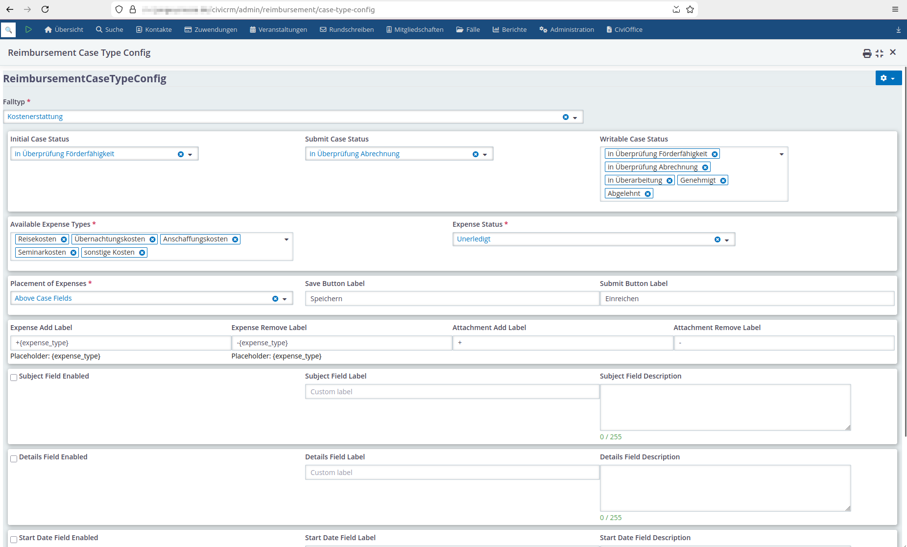

### In Drupal: Load the Create Form

Load the *create form* at the URL:

- `civiremote/case/add/reimbursement`

On top of the form the expense-section is being displayed above the fields-section, as configured earlier.
Here one can also see buttons for expenses:

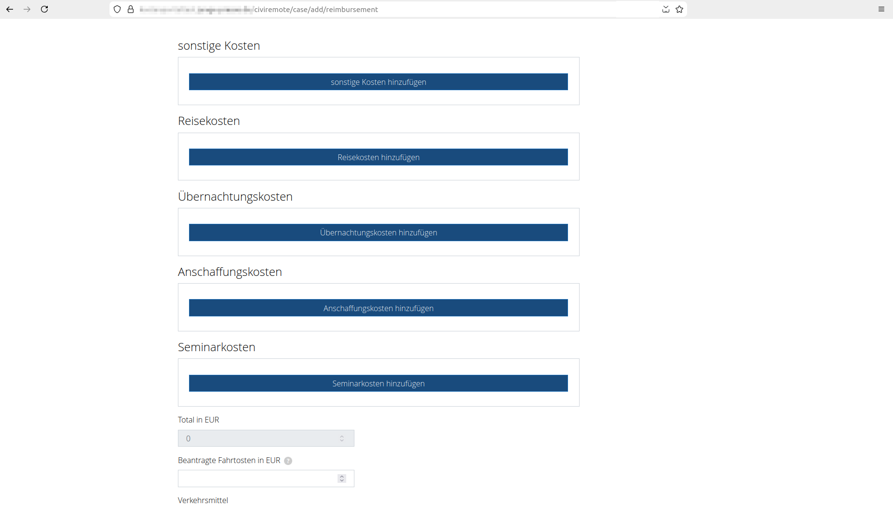

Then following all *custom fields* that have been attached to a case, but no core `Case` fields, as configured earlier:

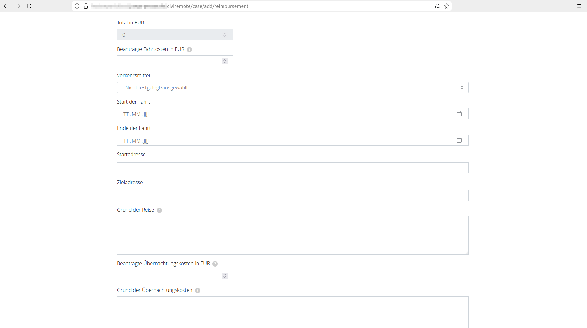

Finally, the `Save` button and the `Submit` button that will trigger two different *case status* assignments upon form submission, as configured earlier:

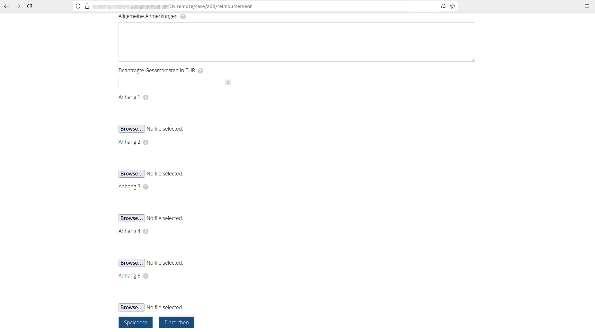

### In Drupal: Load the Update Form

Load the *update form* for a particular case at the URL:

- `civiremote/case/<ID>/update/reimbursement`

All existing expense and case data have been pre-filled. The sum of all expense items will be calculated:

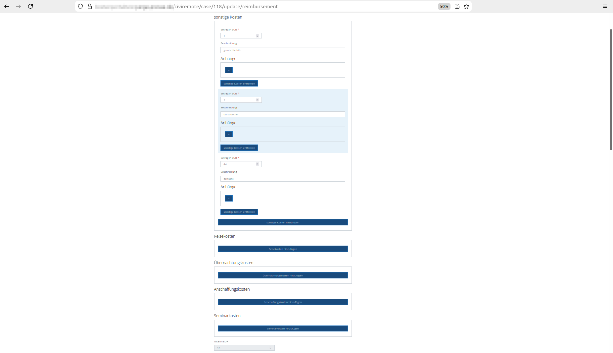

Finally, the `Save` button and the `Submit` button.
Only the `Submit` button will cause a *case status* assignment upon form submission, as configured earlier, 
The `Save` button just updates the case without altering its state:

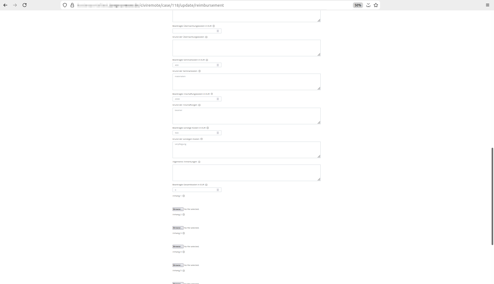

## Use Case: Multiple Case Types

### In CiviCRM: Add an Additional Case Type with no Custom Fields

Add a new *case type* and add *case statuses* for that type.

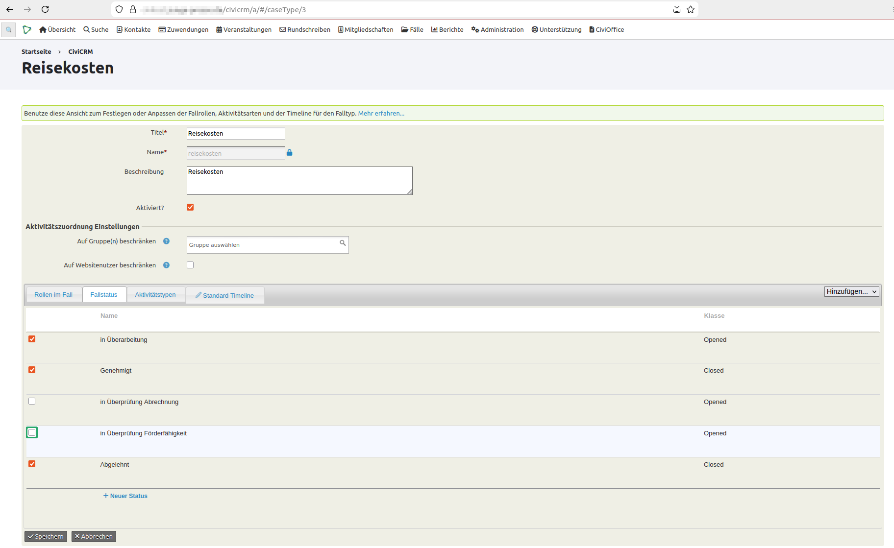

### In CiviCRM: Configure the Reimbursement Extension

Create a second profile for the new *case type*.

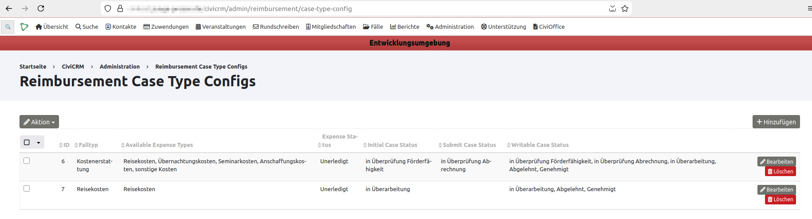

Configure the new profile:
Here want to see the following behavior of the rendered frontend form:

- set the Initial *case status* for a new case upon case-creation
- set the submission *case status* for a new or existing case upon submission
    - here we do not want to enable the `Submit` button in the frontend form
- choose the *expense types* to be shown in the frontend form
    - here we just want a single *expense type* for which costs can be registered in the case
- set the status of a new expense to a particular *status type*
- choose where to display the expenses in the frontend form
    - here we want to place the expense section below the case fields section
- assigning a label to the `Save` button
    - the `Save` button does not cause a change of *case status* upon form submission, except when the case is being created, as selected as initial *case status*
- enable particular core `Case` fields that should be displayed in the frontend form
    - as there are no *custom fields* we just want to enable the `Subject` and `Details` core `Case` fields

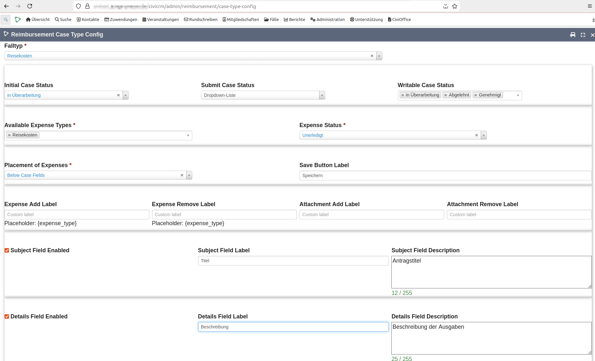

### In Drupal: Load the Create Form

Load the *create form* at the URL:

- `civiremote/case/add/reimbursement`

As there are now two configured `reimbursement` profiles, a list is displayed now in order to select the form to display.

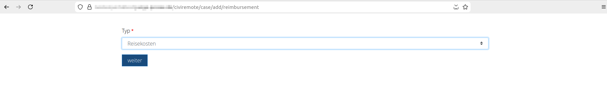

Once the profile has been selected, a redirect happens to

- `civiremote/case/add/reimbursement?type=reisekosten`

On top of the form the two selected core `Case` fields are shown.
The expense-section is being displayed below the fields-section, as configured earlier.
There is now only a single `Save` button:

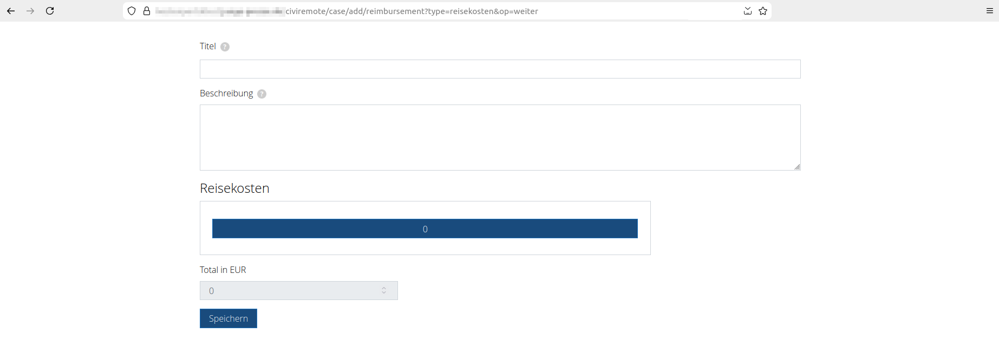

## Handling Case Status Changes

As explained in [configure the `reimbursement` extension](#in-civicrm-configure-the-reimbursement-extension), the *case status* of a case will be set automatically by the `reimbursement` extension on two occasions

- upon submitting the initial frontend form data that causes the creation of a case in CiviCRM
- upon submitting the final frontend form data of an existing case in CiviCRM

As shown here, more *case statuses* can be used, if a particular workflow requires them

- the status of a case can then be set manually in CiviCRM
